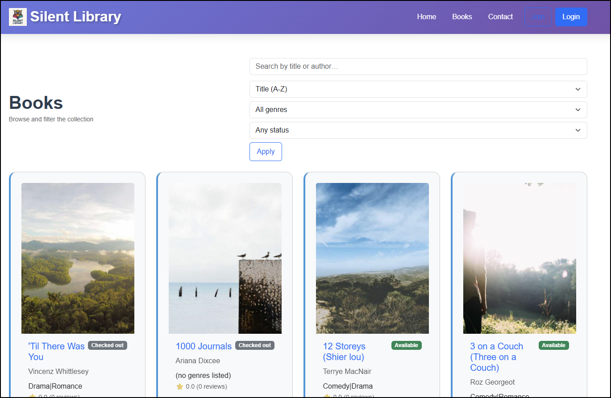
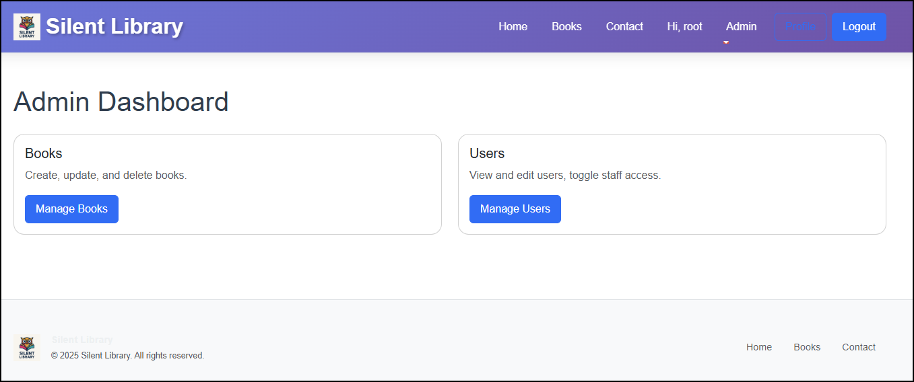

# 📚 Silent Library

A web-based Library Management System built with **Django** and **MySQL**, designed as part of my Full Stack Web Development learning journey.

---

## 📸 Screenshots

### Landing Page


### Books Catalog


### Admin Dashboard



---

## 🚀 Live Demo

🔗 *This is a Django + MySQL project, which cannot run on GitHub Pages.*  
If you’d like to see a live demo, please reach out to me — I can deploy it on **Render / Railway / PythonAnywhere** for demonstration.  

---

## ✨ Features

- User registration & authentication  
- Book catalog with genres and availability  
- Events & promotions page  
- Admin dashboard for managing books and users  
- MySQL database integration  
- Responsive design with Bootstrap  

---

## 🛠 Tech Stack

- **Backend**: Django (Python)  
- **Frontend**: HTML, CSS, Bootstrap  
- **Database**: MySQL  
- **IDE**: Visual Studio Code  
- **Environment**: Python `venv`

---

## ⚡ Setup Instructions

1. Clone the repository:
   ```bash
   git clone https://github.com/<your-username>/silentlibrary_project.git
   cd silentlibrary_project
   ```

2. Create and activate a virtual environment:
   ```bash
   python -m venv venv
   source venv/bin/activate   # macOS/Linux
   venv\Scripts\activate      # Windows
   ```

3. Install dependencies:
   ```bash
   pip install -r requirements.txt
   ```

4. Configure **MySQL Database** in `settings.py`:
   ```python
   DATABASES = {
       'default': {
           'ENGINE': 'django.db.backends.mysql',
           'NAME': 'silentlibrary',
           'USER': 'root',
           'PASSWORD': 'yourpassword',
           'HOST': 'localhost',
           'PORT': '3306',
       }
   }
   ```

5. Apply migrations:
   ```bash
   python manage.py migrate
   ```

6. Run the development server:
   ```bash
   python manage.py runserver
   ```

## Notes
- Ensure MySQL is running before applying migrations.
- Use a `.env` file (with [python-decouple](https://pypi.org/project/python-decouple/)) to keep database credentials secure.
